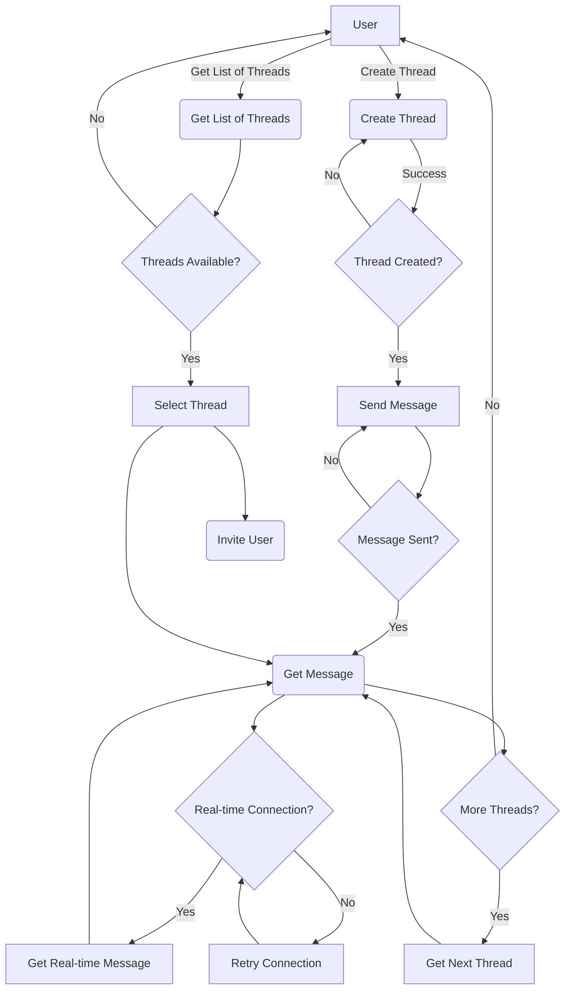

```bash
$ yarn install
```

## Running the app

```bash
# development
yarn run start
```

## Run migration:
Create migration sql from entity class.

```
npx ts-node ./node_modules/typeorm/cli.js migration:generate src/db/migrations/create-table-threads --d ./ormconfig.ts
```

Run migration sql.

```
npx ts-node ./node_modules/typeorm/cli.js migration:run --d ./ormconfig.ts
```

## Frontend:

Create react app.

```
yarn create react-app my-app
```

Connect redis cluster by CLI.

```
docker-compose exec nestjs sh
redis-cli -c -h redis-node-5 -a bitnami
```

## Database.
We have some entity.
- users (id, identity, password, created_at, updated_at)
- threads (id, title, owner_id, created_at, updated_at)
- messages. (id, thread_id, user_id, content, created_at, updated_at)
- thread_users_users (user_id, thread_id, created_at, updated_at)

## Flow diagram.

Flow diagram mermaid code for chat application.
User can
+ create thread
+ send message to thread
+ get message from thread (use realtime socket connection.)
+ get list thread
+ invite user to thread




